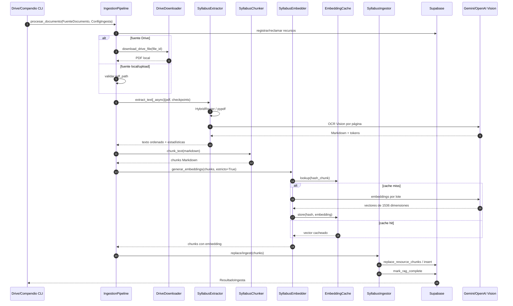
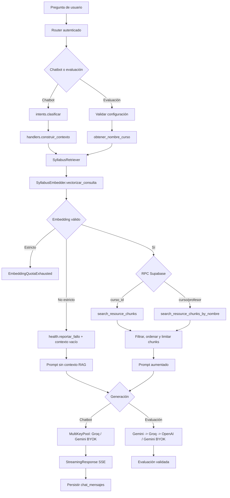

# Arquitectura del sistema RAG de UniVia

**Fecha de auditoría/actualización:** 2026-09-19  
**Alcance:** ingesta de documentos, extracción/OCR, chunking, embeddings,
recuperación semántica, chatbot, evaluaciones y wrappers CLI.

> **Nota de nomenclatura:** la solicitud menciona
> `backend/app/rag/cache.py`, pero ese archivo no existe en el repositorio.
> La implementación equivalente y utilizada por el pipeline es
> [`backend/app/rag/embedding_cache.py`](../backend/app/rag/embedding_cache.py).

## Tabla de contenidos

1. [Resumen ejecutivo](#1-resumen-ejecutivo-de-la-arquitectura-rag)
2. [Mapa de archivos e indicador de responsabilidades](#2-mapa-de-archivos-e-indicador-de-responsabilidades)
3. [Modelos de IA utilizados por etapa](#3-modelos-de-ia-utilizados-por-etapa)
4. [Flujo 1: ingesta y procesamiento](#4-flujo-1-ingesta-y-procesamiento-de-documentos)
5. [Flujo 2: recuperación y generación](#5-flujo-2-recuperación-semántica-y-generación-de-respuestas)
6. [Blindaje, caché y tolerancia a errores](#6-mecanismos-de-blindaje-caché-y-tolerancia-a-errores)
7. [Diagramas Mermaid](#7-diagramas-de-secuencia--flujo-mermaid)
8. [Dependencias, datos y observaciones de auditoría](#8-dependencias-datos-y-observaciones-de-auditoría)

---

## 1. Resumen ejecutivo de la arquitectura RAG

UniVia implementa dos caminos sobre el mismo corpus:

- **Ingesta:** recibe un PDF desde Google Drive, disco local o un upload futuro;
  extrae Markdown mediante texto nativo/OCR Vision; divide el resultado en
  fragmentos; genera vectores de 1536 dimensiones; y persiste el recurso y
  sus fragmentos en Supabase.
- **Consulta:** convierte la pregunta al mismo espacio vectorial que el
  corpus, ejecuta una RPC de búsqueda pgvector, limita/formatea los fragmentos
  y los inyecta en el prompt del chatbot o del generador de evaluaciones.

El orquestador de ingesta es
[`IngestionPipeline`](../backend/app/rag/pipeline.py), que centraliza la lógica
antes duplicada por los wrappers de Drive y compendios. El componente de
recuperación es
[`SyllabusRetriever`](../backend/app/rag/retriever.py). La generación no vive
en el retriever: se resuelve mediante [`app/core/llm.py`](../backend/app/core/llm.py)
desde el router de chatbot o evaluaciones.

La plataforma mantiene dos mecanismos de búsqueda complementarios: la
búsqueda textual/fuzzy de metadatos para localizar tarjetas y recursos, y la
búsqueda semántica RAG para comprender el contenido profundo de los documentos.

### Propiedades arquitectónicas relevantes

1. **Separación de responsabilidades:** extracción, chunking, vectorización,
   persistencia y generación son módulos independientes.
2. **Mismo embedder para documento y consulta:** se evita comparar vectores
   generados por proveedores incompatibles.
3. **Fallback de OCR:** Gemini Vision es preferido; OpenAI Vision continúa la
   corrida si Gemini agota la cuota diaria.
4. **Degradación diferenciada:** el chatbot puede continuar sin contexto si
   falla el embedding; evaluaciones e ingesta usan modo estricto y fallan de
   forma explícita.
5. **Persistencia transaccional preferida:** `replace_resource_chunks` elimina
   e inserta el primer lote; los lotes siguientes se insertan con índices
   globales.
6. **Reanudación:** los checkpoints por página y `drive_modified_time` permiten
   retomar una ingesta sin repetir páginas válidas.

---

## 2. Mapa de archivos e indicador de responsabilidades

### 2.1 Núcleo RAG

| Archivo | Responsabilidad | Entradas principales | Salidas / efectos |
|---|---|---|---|
| [`rag/pipeline.py`](../backend/app/rag/pipeline.py) | Orquestación de una ingesta completa | `FuenteDocumento`, `ConfigIngesta`, cliente Supabase | `ResultadoIngesta`, estados en `recursos` |
| [`rag/pipeline_config.py`](../backend/app/rag/pipeline_config.py) | Contratos, defaults y estados | tipo de fuente y parámetros CLI | dataclasses y códigos de estado |
| [`rag/drive_downloader.py`](../backend/app/rag/drive_downloader.py) | Descarga/reintentos desde Drive | `drive_file_id`, ruta temporal | PDF local o error de red/acceso |
| [`rag/extractor.py`](../backend/app/rag/extractor.py) | Texto nativo y OCR Vision por página | PDF, modo OCR, checkpoints | Markdown ordenado y estadísticas |
| [`rag/hybrid_router.py`](../backend/app/rag/hybrid_router.py) | Decide texto nativo frente a Vision | página/PDF y configuración híbrida | texto nativo o indicación de OCR |
| [`rag/extraction_checkpoint.py`](../backend/app/rag/extraction_checkpoint.py) | Checkpoint individual por página | directorio y número de página | progreso reutilizable en disco |
| [`rag/adaptive_semaphore.py`](../backend/app/rag/adaptive_semaphore.py) | Control de concurrencia adaptativo | límites y señales de proveedor | semáforo para llamadas concurrentes |
| [`rag/chunker.py`](../backend/app/rag/chunker.py) | Segmentación jerárquica Markdown | Markdown extraído | lista de `{contenido}` |
| [`rag/embedder.py`](../backend/app/rag/embedder.py) | Embeddings de documentos y consultas | textos, proveedor y modelo | vectores de 1536 dimensiones |
| [`rag/embedding_cache.py`](../backend/app/rag/embedding_cache.py) | Caché persistente de embeddings | hash SHA-256 y vector | hit/miss en `embedding_cache` |
| `rag/cache.py` | **No existe** | — | usar `embedding_cache.py` |
| [`rag/ingest.py`](../backend/app/rag/ingest.py) | Persistencia de chunks | chunks con embeddings | `resource_chunks`, RPCs de estado |
| [`rag/retriever.py`](../backend/app/rag/retriever.py) | Recuperación semántica | pregunta y filtros | fragmentos ordenados por similitud |
| [`rag/health.py`](../backend/app/rag/health.py) | Observabilidad de fallos RAG | componente y excepción | registro in-memory por proceso |
| [`rag/cost_tracker.py`](../backend/app/rag/cost_tracker.py) | Métricas de consumo | tokens/llamadas Vision | contadores y costo estimado |
| [`rag/generator.py`](../backend/app/rag/generator.py) | Utilidades de generación/compatibilidad | prompts y proveedor | texto generado según su uso |
| [`rag/cargar_compendio.py`](../backend/app/rag/cargar_compendio.py) | Wrapper local histórico | PDF y flags CLI | invoca `IngestionPipeline` |

### 2.2 Consumidores

| Archivo | Responsabilidad RAG |
|---|---|
| [`app/routers/chatbot.py`](../backend/app/routers/chatbot.py) | HTTP, historial, SSE y llamada final al LLM |
| [`app/chatbot/handlers.py`](../backend/app/chatbot/handlers.py) | Construye contexto RAG/relacional por intención |
| [`app/chatbot/intents.py`](../backend/app/chatbot/intents.py) | Clasifica y reformula la consulta |
| [`app/chatbot/consultas.py`](../backend/app/chatbot/consultas.py) | Consultas estructuradas de cursos, docentes y prerrequisitos |
| [`app/chatbot/user_context.py`](../backend/app/chatbot/user_context.py) | Contexto académico del estudiante |
| [`app/chatbot/skills.py`](../backend/app/chatbot/skills.py) | Instrucciones para quiz, cronograma y flashcards |
| [`app/routers/evaluaciones.py`](../backend/app/routers/evaluaciones.py) | Recupera contexto y genera evaluaciones |
| [`app/core/llm.py`](../backend/app/core/llm.py) | Fábricas, modelos y adaptadores OpenAI/Groq/Gemini |
| [`app/core/texto_busqueda.py`](../backend/app/core/texto_busqueda.py) | Búsqueda fuzzy de metadatos, códigos, tipos y semestres |
| [`app/routers/recursos.py`](../backend/app/routers/recursos.py) | Consume el motor fuzzy para filtrar y ordenar tarjetas/recursos |

### 2.3 Wrappers CLI y rutas de operación

| Archivo | Fuente | Comportamiento |
|---|---|---|
| [`scripts_manuales/generar_chunks_desde_drive.py`](../backend/scripts_manuales/generar_chunks_desde_drive.py) | Drive + `recursos` existentes | deduplicación por `drive_file_id`, filtros y ejecución concurrente |
| [`rag/cargar_compendio.py`](../backend/app/rag/cargar_compendio.py) | PDF local | crea/procesa un compendio; conserva modos sync/async |
| [`scripts_manuales/ingestar_recursos_drive.py`](../backend/scripts_manuales/ingestar_recursos_drive.py) | Drive | wrapper operativo relacionado |
| [`scripts_manuales/revectorizar_chunks.py`](../backend/scripts_manuales/revectorizar_chunks.py) | `resource_chunks` existentes | re-vectoriza cuando cambia proveedor/modelo |

### 2.4 Coexistencia de motores de búsqueda

- **Búsqueda fuzzy de metadatos:** [`app/core/texto_busqueda.py`](../backend/app/core/texto_busqueda.py)
  normaliza texto, elimina diacríticos y separadores, exige coincidencia AND
  de todos los tokens y usa `rapidfuzz` con distancia Damerau-Levenshtein
  para tolerar errores tipográficos. También expande aliases de tipos
  (`examen`, `parcial`, `pc`, etc.), formatos de semestre (`2023-1`, `23-II`)
  y expresiones como `ciclo 3`. Su resultado se usa para tarjetas, nombres,
  códigos y filtros de biblioteca; no vectoriza ni consulta el contenido de
  `resource_chunks`.
- **RAG semántico:** [`app/rag/retriever.py`](../backend/app/rag/retriever.py)
  vectoriza la pregunta y consulta pgvector mediante las RPC de Supabase.
  Está destinado al contenido profundo de sílabos, exámenes, prácticas y
  compendios, con filtros opcionales de curso y profesor. Ambos motores pueden
  participar en una misma respuesta, pero cumplen contratos distintos: fuzzy
  localiza metadatos; RAG recupera evidencia textual.

---

## 3. Modelos de IA utilizados por etapa

Los nombres efectivos pueden sobrescribirse mediante variables de entorno. Los
defaults que aparecen en el código son:

| Etapa | Modelo/librería | Proveedor | Fallback |
|---|---|---|---|
| Texto nativo PDF | `pypdf` vía `HybridRouter` | local, sin IA | Vision si la página no tiene texto suficiente |
| OCR de sílabos | `gemini-3.6-flash` (`GEMINI_VISION_MODEL`) | Google Gemini | `gpt-4.1-mini` de OpenAI |
| OCR de exámenes | mismo modelo Vision con `PROMPT_EXAMENES` | Google Gemini | OpenAI Vision |
| OCR de rescate | `PROMPT_SALVAGE` | proveedor Vision activo | página marcada como fallida/ilegible |
| Etiquetado/transcripción OpenAI | `gpt-4.1-mini` (`OPENAI_INGEST_MODEL`) | OpenAI | errores reintentables y/o fallback de OCR |
| Embeddings | `gemini-embedding-001`, dimensión 1536 | Google Gemini | OpenAI `text-embedding-3-small` si se selecciona explícitamente |
| Embeddings alternativos | `text-embedding-3-small`, dimensión 1536 | OpenAI | `EmbeddingQuotaExhausted` en modo estricto; `[]` en chatbot |
| Clasificación de intención | `GROQ_MODEL_CLASIFICADOR` | Groq | regex y categoría `general` |
| Chatbot | `openai/gpt-oss-120b` (`GROQ_MODEL`/`MODELO_CHATBOT`) | Groq, API compatible con OpenAI | Gemini BYOK; después cascada Gemini -> OpenAI |
| Generación general/evaluaciones | `gemini-3.6-flash` (`GEMINI_GEN_MODEL`) | Google Gemini | Groq `openai/gpt-oss-120b` -> OpenAI pagado |
| Evaluaciones con BYOK | modelo Gemini configurado (`GEMINI_GEN_MODEL`) | Google Gemini, clave enviada por el usuario | evita el pool compartido y usa el cupo propio |
| Chatbot con BYOK | modelo Gemini configurado (`GEMINI_GEN_MODEL`) | Google Gemini, `X-User-LLM-Key` | evita el pool compartido y usa el cupo propio |

### MultiKeyPool y cascada de generación

[`app/core/llm.py`](../backend/app/core/llm.py) centraliza la generación
mediante `MultiKeyPool`. Cada proveedor gratuito puede cargar la clave base y
hasta tres claves numeradas (`GEMINI_API_KEY_1..3` y
`GROQ_API_KEY_1..3`), eliminando duplicados y rotándolas en round-robin.
Cuando una clave recibe HTTP 429 o un error 5xx, se coloca en cooldown
individual durante 60 segundos; las demás claves continúan disponibles. Si
todo el pool se agota, la cascada intenta el siguiente proveedor:

```text
Gemini / gemini-3.6-flash
        -> Groq / openai/gpt-oss-120b
                -> OpenAI GPT pagado (último recurso)
```

La selección es configurable con `LLM_PROVIDER` y `LLM_FALLBACKS`, pero el
orden operativo por defecto prioriza cuota gratuita. El soporte **BYOK**
(`X-User-LLM-Key`) constituye un nivel anterior a la cascada compartida:
chatbot y evaluaciones pueden ejecutar Gemini con la clave efímera del usuario,
sin registrarla ni persistirla.

### Reglas de compatibilidad vectorial

- La columna de `resource_chunks.embedding` espera 1536 dimensiones.
- Gemini usa `RETRIEVAL_DOCUMENT` para corpus y `RETRIEVAL_QUERY` para preguntas.
- OpenAI no distingue esos `task_type`.
- No se deben mezclar vectores Gemini y OpenAI en el mismo corpus. Cambiar
  `EMBEDDINGS_PROVIDER` requiere ejecutar
  [`revectorizar_chunks.py`](../backend/scripts_manuales/revectorizar_chunks.py).

---

## 4. Flujo 1: Ingesta y procesamiento de documentos

### 4.1 Paso a paso

1. **Selección de fuente**
   - Drive: `FuenteDocumento(tipo="drive", drive_file_id=...)`.
   - Local/upload: `FuenteDocumento(..., pdf_path=...)`.
   - El wrapper configura `ConfigIngesta` y llama
     `IngestionPipeline.procesar_documento`.

2. **Identidad y estado**
   - Si existe `recurso_id`, se reutiliza la fila de `recursos`.
   - Si no existe, `_registrar_recurso` inserta `curso_id`, `titulo` y `tipo`.
   - Con `reclamar=True`, `reclamar_recurso` cambia atómicamente
     `rag_status` a `processing`.

3. **Descarga**
   - `descargar_pdf` guarda temporalmente el archivo en
     `tempfile.gettempdir()/univia_rag_drive`.
   - `drive_downloader` traduce problemas de acceso a
     `RecursoInaccesible` y problemas de red a `NetworkDownloadError`.

4. **Checkpoints**
   - `preparar_checkpoints` usa `<pdf>_checkpoints/.drive_modified_time`.
   - Se borran checkpoints si `resume=False` o cambia la versión de Drive.
   - `ExtractionCheckpoint` guarda el texto/progreso por página.

5. **Extracción**
   - `modo_extraccion="sync"` llama `SyllabusExtractor.extract_text`.
   - `modo_extraccion="async"` llama `extract_text_async`.
   - `hybrid=True` deja que `HybridRouter` use `pypdf` para páginas nativas.
   - Las páginas escaneadas pasan a Gemini Vision y pueden caer a OpenAI Vision.
   - `SyllabusExtractor.last_run_stats` registra páginas nativas, Vision y
     llamadas Vision.

6. **Validación**
   - Texto vacío: causa `empty_extraction`.
   - Secuencia incompleta: `paginas_incompletas`.
   - `salvage` intenta rescatar páginas parcialmente legibles.
   - `skip_failed` permite continuar con marcadores de páginas fallidas cuando
     el wrapper lo habilita.

7. **Chunking**
   - `SyllabusChunker(chunk_size=1200, chunk_overlap=200)`.
   - Primero separa por `#`, `##`, `###`; luego aplica división recursiva.
   - Cada fragmento conserva metadata como `Tema Principal`, `Subtema` o
     `Ejercicio_o_Seccion` dentro de `contenido`.
   - Sin chunks: causa `no_chunks`.

8. **Vectorización**
   - `SyllabusEmbedder` procesa lotes de 20 por defecto.
   - `EmbeddingCache` busca por hash antes de llamar a la API.
   - Los misses se vectorizan y se guardan en caché.
   - Una corrida estricta no se marca completa si falta algún lote o embedding.
   - Sin vectores: causa `no_embeddings`; cantidad incompleta:
     `embeddings_incomplete`.

9. **Persistencia**
   - `SyllabusIngestor.replace` valida dimensión 1536.
   - Primer lote: RPC `replace_resource_chunks` (borra anteriores e inserta).
   - Lotes posteriores: inserción directa con `chunk_index` global.
   - Alternativamente `ingest` inserta lotes de 50 sin el mismo nivel
     transaccional.
   - Se llama `mark_rag_complete` al finalizar.

10. **Estado final**
    - Éxito: `recursos.rag_status = complete`.
    - Fallos esperados: `failed`, `skipped_permissions` o `network_error`.
    - `rag_error` conserva la causa corta; `ResultadoIngesta` expone métricas y
      si el recurso fue creado por esa ejecución.

### 4.2 Diagrama ASCII de ingesta

```text
PDF Drive/local/upload
        |
        v
generar_chunks_desde_drive.py / cargar_compendio.py
        |
        v
IngestionPipeline.procesar_documento()
        |
        +--> recursos: registrar/reclamar rag_status=processing
        |
        +--> drive_downloader -> PDF temporal
        |
        +--> checkpoints por página (.drive_modified_time)
        |
        +--> HybridRouter
        |       +--> pypdf: texto nativo
        |       +--> Gemini Vision
        |              \--> OpenAI Vision si cuota agotada
        |
        +--> SyllabusChunker
        |       \--> MarkdownHeaderTextSplitter
        |           + RecursiveCharacterTextSplitter
        |
        +--> SyllabusEmbedder (lotes)
        |       +--> EmbeddingCache -> embedding_cache
        |       \--> Gemini/OpenAI embeddings (1536)
        |
        \--> SyllabusIngestor
                +--> replace_resource_chunks / inserts
                +--> resource_chunks
                \--> mark_rag_complete -> recursos
```

---

## 5. Flujo 2: recuperación semántica y generación de respuestas

### 5.1 Chatbot

La ruta HTTP principal es `POST /api/chatbot/mensajes`, registrada bajo
`/api`. El flujo es:

1. Autenticación y carga de conversación/historial.
2. Límite de 4000 caracteres por mensaje y 12 turnos de contexto.
3. `intents.clasificar` determina la intención; si falla, usa rescates regex o
   `general`.
4. `handlers.construir_contexto` combina:
   - RAG semántico para dudas académicas.
   - consultas relacionales para recursos, docentes, prerrequisitos y progreso.
   - contexto personal de `user_context.py`.
5. Para una duda académica, `SyllabusRetriever(token=token)`:
   - vectoriza con `RETRIEVAL_QUERY`;
   - llama `search_resource_chunks` o una búsqueda equivalente por nombre;
   - aplica umbral aproximado `0.40`, límites de fragmentos y máximo de
     caracteres de contexto.
6. `app/core/llm.py::chatear` usa `openai/gpt-oss-120b` en Groq mediante el
   pool de claves; si el usuario envía `X-User-LLM-Key`, el turno usa Gemini
   BYOK antes del pool.
7. `StreamingResponse` entrega SSE; se persiste el mensaje en
   `chat_mensajes` y se actualiza la conversación.
8. Si falla la vectorización en modo no estricto, `health.py` registra el
   fallo y el handler puede continuar con contexto vacío, sin inventar que
   encontró material.

### 5.2 Evaluaciones

[`evaluaciones.py`](../backend/app/routers/evaluaciones.py) usa un retriever
lazy y autenticado cuando recibe token:

1. Valida `curso_id`, módulo, temas y número de preguntas.
2. Resuelve `cursos.name` desde `curso_id`.
3. Llama `buscar_contexto_por_nombre` con:
   - `limit=10`;
   - umbral `0.4`;
   - filtro opcional `profesor_id`;
   - `estricto=True`.
4. Conserva siempre el resultado de mayor similitud y muestrea hasta cuatro
   fragmentos adicionales.
5. El contexto recuperado se incorpora al prompt de generación de preguntas.
6. La cascada Gemini -> Groq -> OpenAI devuelve la evaluación estructurada;
   el router valida y normaliza preguntas, explicaciones y LaTeX. Si se envía
   una clave BYOK, Gemini usa directamente el cupo del usuario.
7. Si se agota la cuota de embeddings, se propaga
   `EmbeddingQuotaExhausted` en lugar de generar una evaluación sin evidencia.

### 5.3 Selección de búsqueda según el objetivo

Antes o junto con la recuperación RAG, los consumidores pueden usar el motor
de metadatos de [`app/core/texto_busqueda.py`](../backend/app/core/texto_busqueda.py):

- `rapidfuzz.distance.DamerauLevenshtein` acepta typos y transposiciones en
  palabras suficientemente largas.
- El matching es AND estricto: si falta un token, el recurso no coincide.
- Los aliases de exámenes/prácticas y las variantes de semestre se expanden
  antes de puntuar.
- `ciclo N` se evalúa como filtro estructurado de ciclo, no como texto libre.

Ese camino sirve para tarjetas, títulos, códigos y filtros de biblioteca
consumidos por `recursos.py`. Cuando la intención exige explicar o generar
contenido a partir del material, se utiliza `SyllabusRetriever` y pgvector.
La búsqueda fuzzy no sustituye la recuperación semántica: reduce el universo
por metadatos o resuelve un recurso exacto, mientras que RAG recupera los
fragmentos relevantes de su contenido.

### 5.4 Diagrama ASCII de consulta

```text
Pregunta autenticada
        |
        v
/api/chatbot/mensajes       /api/evaluaciones
        |                            |
        v                            v
intents.clasificar          validar ConfiguracionEvaluacion
        |                            |
        +--------> handlers / recuperar_contexto_semantico
                              |
                              v
                     SyllabusRetriever
                              |
                              v
                 SyllabusEmbedder (query)
                              |
                              v
              RPC Supabase + filtro curso/profesor
                              |
                              v
                  chunks ordenados por similitud
                       |                 |
                       v                 v
                 Prompt chatbot     Prompt evaluación
                       |                 |
                       v                 v
              MultiKeyPool + SSE   MultiKeyPool/Gemini BYOK + JSON
                       |
                       v
                 guardar chat_mensajes
```

---

## 6. Mecanismos de blindaje, caché y tolerancia a errores

### 6.1 Checkpoints y reanudación

- Directorio por PDF y marcador de versión Drive.
- Reutilización de páginas completadas con `resume=True`.
- Validación opcional de secuencia 1..N.
- Reensamblado en orden aunque la extracción async termine fuera de orden.
- `es_sospechosa` evita persistir respuestas del modelo que repitan el prompt,
  negativas o texto de control.

### 6.2 `EmbeddingCache`

- Normaliza trim, casing y whitespace.
- Calcula SHA-256 estable del contenido.
- Usa `embedding_cache.chunk_hash` como clave de upsert.
- Convierte vectores pgvector serializados como string a `list[float]`.
- Un fallo de cache solo genera warning y fuerza una llamada normal; no
  convierte un hit/miss en un falso éxito.
- En conjunto con `MultiKeyPool`, la caché evita repetir embeddings ya
  calculados y el pool rota claves gratuitas para que la generación opere con
  cuota compartida de **$0 para UniVia** mientras haya claves disponibles. El
  ahorro de costo aplica a dos superficies distintas: `EmbeddingCache` reduce
  llamadas de vectorización y `MultiKeyPool` distribuye la generación entre
  cuotas gratuitas.

### 6.3 Generación resiliente y blindaje de tokens

- `MultiKeyPool` rota claves Gemini/Groq en round-robin y aplica cooldown
  individual de 60 segundos ante 429/5xx.
- `ProveedorPoolExhausted` activa la cascada Gemini -> Groq -> OpenAI pagado,
  sin exigir cambios en los consumidores.
- `_llamar_gemini` captura `ValueError` al leer `respuesta.text` cuando Gemini
  devuelve una respuesta bloqueada, truncada o sin texto utilizable. Registra
  un warning y devuelve cadena vacía, evitando que un corte de tokens derribe
  la petición completa.
- El BYOK de chatbot y evaluaciones usa un cliente efímero: la clave del
  usuario abre su propio cupo, no se guarda en el pool compartido y no se
  registra en logs.

### 6.4 Límites y concurrencia

- OCR: `rpm`, `max_retries`, throttling y backoff con jitter.
- Ingesta async: `max_concurrency` y `AdaptiveSemaphore`.
- Embeddings: lotes de 20 y hasta cinco reintentos ante 429/cuota.
- Chatbot: mensaje máximo 4000 caracteres, historial máximo 12 turnos,
  respuesta máxima 1024 tokens y contexto RAG acotado.
- Drive: el wrapper detiene o reduce el procesamiento después de fallos
  consecutivos para evitar consumir cuota inútilmente.

### 6.5 Estados y errores explícitos

| Situación | Comportamiento |
|---|---|
| Recurso inaccesible | `skipped_permissions` |
| Error de red descargando Drive | `network_error` |
| Texto vacío | `failed` + `empty_extraction` |
| Páginas incompletas | `failed` + `paginas_incompletas` |
| Sin chunks | `failed` + `no_chunks` |
| Embeddings incompletos | `failed` + `embeddings_incomplete` |
| Cuota de embeddings en modo estricto | `EmbeddingQuotaExhausted` |
| Cuota de embeddings en chatbot | log + `health.reportar_fallo` + `[]` |
| Error inesperado de pipeline | `failed` + `error_inesperado` |
| Recurso reclamado por otro worker | `reclamado_por_otro` sin escribirlo en BD |

### 6.6 `health.py` y observabilidad

`reportar_fallo` conserva hasta 20 fallos recientes por componente, trunca el
mensaje a 500 caracteres y nunca interrumpe el flujo. `ultimo_fallo` sirve para
diagnóstico puntual y `estado` expone edad y conteo.

El registro es **in-memory por proceso**: no sobrevive reinicios ni se
comparte entre workers. No reemplaza logs ni métricas externas.

### 6.7 Puntos de atención detectados

1. `cache.py` no existe; documentación y nuevos imports deben usar
   `embedding_cache.py`.
2. `ConfigIngesta` declara `connect_timeout` y `read_timeout`, pero
   `descargar_pdf` no los transmite actualmente al downloader.
3. `cargar_compendio.py` valida `CLAUDE_GEN_API_KEY`, aunque el camino de
   ingesta observado usa OpenAI/Gemini; parece una dependencia histórica.
4. `ingest()` devuelve `False` ante ciertos errores y no ofrece el mismo
   rollback que `replace()`.
5. Si fallan todos los reintentos de `actualizar_estado`, el error queda en
   logs y no necesariamente llega al caller.
6. `health.py` no es un almacén distribuido; en despliegues multi-worker cada
   proceso tiene una vista parcial.
7. Cambiar el proveedor de embeddings sin revectorizar produce similitudes
   semánticamente inválidas aunque las dimensiones coincidan.
8. La cascada de generación depende de que existan claves configuradas en los
   pools; si no hay claves gratuitas disponibles, OpenAI es el último recurso
   pagado o se reporta que ningún proveedor está disponible.

---

## 7. Diagramas de secuencia / flujo Mermaid

### 7.1 Ingesta



### 7.2 Consulta semántica y generación



---

## 8. Dependencias, datos y observaciones de auditoría

### 8.1 Dependencias Python y del sistema

Las dependencias relevantes de
[`backend/requirements.txt`](../backend/requirements.txt) son:

- `supabase`, `asyncpg`, `python-dotenv`: persistencia/configuración.
- `openai`, `google-genai`, `anthropic`: proveedores LLM/embeddings y
  compatibilidad histórica.
- `pdf2image`, `pypdf`, `Pillow`: PDF, renderizado y procesamiento de imagen.
- `langchain-text-splitters`: segmentación Markdown/recursiva.
- `gdown`, `requests`, `httpx`: descarga y HTTP.
- `pytest`, `pytest-asyncio`: pruebas del módulo RAG.

Además, `pdf2image` necesita Poppler disponible; la ruta se configura con
`POPPLER_PATH`.

### 8.2 Tablas y RPCs Supabase

**RAG:** `recursos`, `resource_chunks`, `embedding_cache`.  
**Catálogo:** `cursos`, `facultades`, `carreras`, `mallas`, `malla_cursos`,
`malla_curso_prerrequisitos`.  
**Docentes:** `profesores`, `curso_profesores`.  
**Usuario:** `perfiles`, `progreso_cursos`.  
**Chat:** `conversaciones`, `chat_mensajes`.

**RPC de ingesta:** `replace_resource_chunks`, `mark_rag_complete`.  
**RPC de recuperación:** `search_resource_chunks`,
`search_resource_chunks_by_nombre`.

### 8.3 Contrato resumido de datos

```text
recursos
  id, curso_id, titulo, tipo, drive_file_id,
  rag_status, rag_error, drive_modified_time,
  rag_processed_modified_time, profesor_id

resource_chunks
  recurso_id, curso_id, chunk_index, contenido,
  embedding vector(1536), created_at

embedding_cache
  chunk_hash único, embedding vector
```

La recuperación por nombre de curso permite que un mismo material ingestado
para una materia se comparta entre variantes de carrera. El filtro opcional de
`profesor_id` restringe el corpus para evaluaciones y consultas específicas.

### 8.4 Conclusión

El diseño actual es un pipeline RAG con persistencia pgvector, OCR en cascada y
consumidores separados por intención. Sus defensas más importantes son la
reanudación por página, la caché de embeddings, el uso coherente del proveedor
vectorial, el modo estricto para flujos críticos y la degradación controlada
del chatbot. Las principales obligaciones operativas son mantener homogéneo el
modelo de embeddings, monitorizar los fallos por proceso y preferir
`replace_resource_chunks` cuando se requiera consistencia transaccional.
